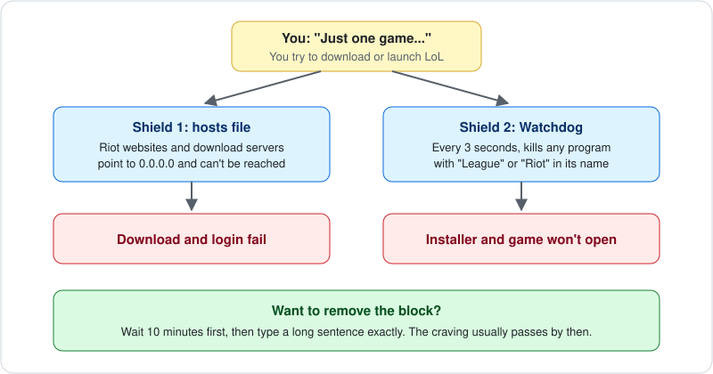

# League of Legends Blocker

I kept uninstalling League and reinstalling it a few days later, so I wrote this with help of claude code to make reinstalling harder. It's a couple of PowerShell scripts for Windows.

## What it does

`block.bat` does two things:

- Adds Riot and League domains to the hosts file, so the installer can't download and the client can't log in.
- Sets up a scheduled task that starts with Windows and closes any process with "League" or "Riot" in its name every 3 seconds.

The first time you run it, it also opens a YouTube video.

It doesn't uninstall the game or delete anything.

## Usage

Download the repo as a ZIP, extract it and double-click `block.bat`. It asks for admin rights because it edits the hosts file and creates a scheduled task.

If SmartScreen shows up, click More info, then Run anyway. You can read the scripts first, they're in `scripts/`.

## Removing it

Run `unblock.bat`. It opens a different video, makes you wait 10 minutes, then asks you to type "I really want this and I accept the consequences". If you type it correctly it removes everything, otherwise nothing changes.

The wait is on purpose. If you don't trust yourself with it, delete `unblock.bat` and `scripts/unblock.ps1` after installing, or give them to a friend.

## What it changes

- Lines ending in `# LOLBLOCK` in `C:\Windows\System32\drivers\etc\hosts`
- The folder `C:\ProgramData\LolBlock`
- A scheduled task called `LolBlock`

Both scripts write to `lolblock.log` next to the .bat files. Nothing is sent anywhere.

Some antivirus programs may flag the scripts because they edit the hosts file and kill processes.

## Limitations

- It's easy to get around if you know Windows: edit the hosts file, delete the task, use a VPN or another PC.
- It also closes Valorant and anything else from Riot.
- Windows only.

